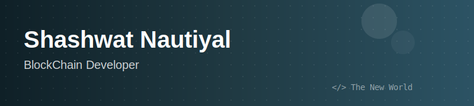

    

<h1 align="center"> Hii</h1>
<h3 align="center">I write code.</h3>

- 🌱 I'm interested in **blockchain protocols, distributed systems, and cryptography**
- 📍 I'm learning Ethereum Core Protocol and low-level systems with Rust
- ⚙️ Curious about how systems work, especially when they don’t 
- 🎥 Moving the plot forward with acceptable technical debt
- 💬 Reach out at  [X](https://x.com/hiha_shash)

## 🧪 Selected Projects

- **[x402 PolyAgents](https://github.com/Shashwat-Nautiyal/x402-polyagents)** — Decentralized micro-services for autonomous agents using pay-per-request semantics  
- **[Map-Reduce](https://github.com/Shashwat-Nautiyal/Distributed_Systems)** — Distributed MapReduce implementation focusing on coordination and failure handling
- **[Rust Compiler](https://github.com/Shashwat-Nautiyal/rust_compiler)** — Building a compiler to understand parsing, type systems, and code generation
- **[Agentic-ETH](https://github.com/Shashwat-Nautiyal/agentic-eth)** — Experiments with agentic workflows over Ethereum core primitives  

## ⚖️ Beyond Code

- I play Football (state-level)
- I read and I overthink

##  Socials 

**Languages and Tools**      

 

---
⭐️ From [Shashwat-Nautiyal](https://github.com/Shashwat-Nautiyal)
